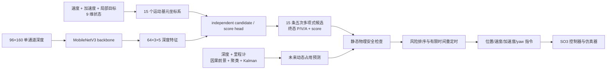

# DE-P：基于 YOPO-Simple 的静态规划与动态安全导航

DE-P 是一个面向无人机自主导航的 YOPO-Simple 改进工程。当前冻结版本采用 Route A：由 MobileNetV3 网络负责生成和评分静态避障轨迹，在运行时使用因果动态感知、线性 Kalman 跟踪和预测碰撞过滤处理移动障碍；当局部规划持续停滞时，使用有限角度扫描和临时恢复目标重新把控制权交给同一个网络。

当前可复现发布为：

- 发布标签：`route-a-v4.9.1-recovery-subgoal-v6.1-runtime-authority`
- 静态策略：V4.8.3 candidate-only，四类地图训练
- 动态安全：V4.9 motion-preserving dynamic safety
- 防卡死恢复：V4.9.1 temporary-subgoal lifecycle V6
- 冻结权重：`runs/route_a_static_yopo_v4_8_3_candidate_only_shakedown/20260813T050742Z-13178/checkpoints/best.pth`
- 权重 SHA-256：`22e5c63c273d751c15479d70c99d9b85ad615b7b4c62063946a5b1683776ac60`

> 本文以实际脚本和配置为准。旧的 Phase 8 实验文件仍保留在工程中，但不代表它们属于当前发布主链路。

## 1. 当前系统做了什么

### 1.1 网络与运行时主链路



网络输入和输出的固定形状为：

| 张量 | 形状 | 含义 |
|---|---:|---|
| depth | `B×1×96×160` | 前向深度图 |
| observation | `B×9` | 机体系速度、加速度和目标，各 3 维 |
| backbone feature | `B×64×3×5` | 对应 15 个运动基元的视觉特征 |
| endstate | `B×9×3×5` | 15 条候选的终止位置、速度和加速度 |
| score | `B×3×5` | 15 条候选的网络代价，越小越优 |

训练阶段使用静态 canonical occupancy/ESDF 计算 smoothness、static safety 和 guidance 代价，并将轨迹代价的梯度传回候选生成器；Score head 学习同批候选的相对总代价。当前正式 V4.7 数据是 **actor-free 静态数据**。移动 actor 不作为网络训练答案输入，而是在 ROS 运行时由动态安全层预测和过滤。

### 1.2 当前动态避障边界

默认的 `dynamic_safety` 模式执行：

1. 将深度图与里程计同步；
2. 使用 `range_image_hybrid` 提取因果时序前景；
3. 使用 DBSCAN 形成观测簇；
4. 使用 6 维常速度 **线性 Kalman Filter** 跟踪位置和速度；
5. 预测 actor 的未来占用和轨迹碰撞风险；
6. 拒绝预计相交的候选，在其余候选中进行有界风险排序和 `1.0/1.2/1.4` 时间缩放；
7. 始终由网络候选提供平移轨迹，安全层不凭空生成另一条路线。

`dynamic_attention` 可以把跟踪注意力送入 CNN，但它不是 V4.9.1 冻结发布的默认路径；正式复现请使用 `dynamic_safety`。

## 2. 复现层级与已知边界

本工程区分四个复现层级：

| 目标 | 干净克隆是否足够 | 额外内容 |
|---|---|---|
| 校验算法和最终权重 | 是 | Conda `yopo` 环境 |
| 重新生成 V4.7 数据 | 否 | Simulator 源码、CUDA GPU、约 30 GiB 空间，以及正式绝对路径 |
| 重新训练完整 V4.7→V4.8→V4.8.3 链路 | 否 | V4.7 数据和 V4.6 初始父权重；后续父权重由前一阶段产生 |
| 精确回放当前四场景 RViz fixture | 否 | Controller/Simulator 构建产物，以及四张冻结点云/authority 资产 |

源码发布中已经跟踪最终 5.4 MB 的 V4.8.3 权重，因此 **只做推理无需重训**。大型数据集、点云、occupancy 和历史父权重没有全部提交到 Git。

数据与训练脚本仍带有冻结合同绝对路径 `/home/zjh/YOPO/DE-P`。要逐哈希复现正式数据和训练，应使用这一目录；只运行 V4.9.1 推理入口则可以使用其他克隆位置。

## 3. 环境准备

### 3.1 参考环境

- Ubuntu 20.04
- ROS Noetic
- Conda 环境：`yopo`
- Python 3.10（当前宿主环境）
- PyTorch `2.7.0+cu128`
- torchvision `0.22.0+cu128`
- CUDA build 12.8
- 已验证 GPU：NVIDIA GeForce RTX 5070 Ti Laptop GPU，compute capability `(12, 0)`

不要执行以下操作：

- 不要运行旧的 `pip install -r requirements.txt`；
- 不要降级或重装 torch、torchvision、CUDA；
- 不要用 pip 覆盖 ROS Noetic 的 `empy/em`、`rospy`、`cv_bridge` 或消息包。

Python 依赖已经按用途拆分：

- `requirements-core.txt`：静态网络、数据和训练；
- `requirements-dynamic.txt`：在 core 基础上增加 FilterPy 等动态感知依赖；
- `requirements-ros.txt`：仅说明 ROS 依赖来源，不用于 pip 安装；
- `requirements-dev.txt`：测试说明。

已有 `yopo` 环境时只补缺失包：

```bash
conda activate yopo
python -m pip install -r requirements-dynamic.txt
python -m pip install pytest
```

### 3.2 推荐仓库布局

完整 ROS 推理要求三个同级目录：

```text
/home/zjh/YOPO/
├── DE-P/
├── Controller/
└── Simulator/
```

使用冻结标签克隆私有发布仓库：

```bash
git clone --branch route-a-v4.9.1-recovery-subgoal-v6.1-runtime-authority \
  https://github.com/ZhangJunhe2005/DE-P.git /home/zjh/YOPO
cd /home/zjh/YOPO/DE-P
```

若仓库已经位于其他目录，可直接做算法校验和 V4.9.1 推理；正式数据生成/训练前则需要先处理脚本与 YAML 中的绝对路径，并重新建立相应身份哈希。不要只用 `sed` 替换后继续声称是原冻结数据合同。

### 3.3 校验 PyTorch 与宿主机 GPU

```bash
nvidia-smi

conda run --no-capture-output -n yopo python - <<'PY'
import torch

print("torch:", torch.__version__)
print("torch CUDA build:", torch.version.cuda)
print("CUDA available:", torch.cuda.is_available())
if torch.cuda.is_available():
    print("GPU:", torch.cuda.get_device_name(0))
    print("capability:", torch.cuda.get_device_capability(0))
PY
```

如果命令运行在容器、CI 或受控沙箱中，必须确认 `/dev/nvidia*` 和宿主 NVIDIA 驱动接口确实传入；沙箱内的 `CUDA available: False` 不能自动代表宿主机 GPU 不可用。

### 3.4 构建 ROS 工作区

在 Conda 环境外构建，避免 Python/ROS 工具链互相覆盖：

```bash
conda deactivate
source /opt/ros/noetic/setup.bash

cd /home/zjh/YOPO/Controller
catkin_make -j8

cd /home/zjh/YOPO/Simulator
catkin build -j8
```

Simulator 还需要 CUDA、PCL、OpenCV 和 yaml-cpp：

```bash
sudo apt-get install libyaml-cpp-dev
```

RTX 50 系 GPU 编译 CUDA Simulator 时若自动架构检测失败，参见 `Simulator/src/readme.md`，为本机架构显式设置 `compute_120/sm_120`。

## 4. 最短路径：验证并运行已经训练好的模型

### 4.1 无 ROS 的发布校验

以下命令不启动 ROS master、不改数据、不执行训练：

```bash
cd /home/zjh/YOPO/DE-P
conda activate yopo
bash scripts/verify_route_a_v4_9_1_checkout.sh
```

它会校验最终权重 SHA-256，并运行 V4.9/V4.9.1 的聚焦测试。机器可读发布身份位于 `configs/route_a_v4_9_1_release_manifest.yaml`。

### 4.2 准备 RViz 场景资产

四场景 fixture 使用以下文件：

- `data/route_a_v4_6_static_yopo/maps/*.ply` 中的四张冻结点云；
- `data/route_a_v4_9_1_demo_authority/valid/<map_uuid>/` 下的 canonical occupancy；
- `configs/dep_interactive_demo_scenes_v4_6.json` 中的起点、目标、地图 UUID 和哈希合同。

这些大型文件不属于 source-only Git 交付。先从项目数据备份或发布资产包恢复四张原始 PLY；其期望哈希记录在 `configs/route_a_v4_9_1_release_manifest.yaml`。若 PLY 已经存在但 demo authority 被清理，可执行：

```bash
bash scripts/restore_route_a_v4_9_1_demo_authority.sh
```

该脚本只接受哈希完全匹配的 PLY，并重新验证 raw cloud、occupancy 和 authority manifest；它不会重建完整训练集。

随后进行不启动 ROS 的完整资产预检：

```bash
bash scripts/verify_route_a_v4_9_1_checkout.sh --runtime-assets
```

### 4.3 启动动态 RViz 推理

入口会一次性启动 roscore、SO3 控制器、CUDA Simulator、碰撞监视器、DE-P 节点和 RViz：

```bash
cd /home/zjh/YOPO/DE-P
conda activate yopo
bash scripts/route_a_v4_9_1_dynamic_rviz_host.sh pillar
```

可用场景：`cave`、`forest`、`pillar`、`wall`。默认配置为：

- V4.8.3 冻结权重；
- 16 个 `uniform_3d` 移动 actor；
- actor seed `9098`；
- `dynamic_safety`；
- `range_image_hybrid` 因果前景；
- 3 m/s 规划速度；
- `bounded_scan_v3` 防卡死恢复；
- 5 m 到达半径；
- 交互目标模式。

RViz 打开后选择 **2D Nav Goal**。XY 来自点击位置，Z 使用该场景配置的固定飞行高度；飞行过程中可以重新设置目标，新目标会覆盖当前任务和恢复临时目标。

常用变体：

```bash
# 纯静态对照
bash scripts/route_a_v4_9_1_dynamic_rviz_host.sh forest \
  --actors none --actor-count 0 --dynamic-mode static_reactive

# 固定起点/目标 A/B 复现
bash scripts/route_a_v4_9_1_dynamic_rviz_host.sh cave \
  --goal-mode fixed-ab

# 改变 actor 数量与随机种子；支持 1～64 个 actor
bash scripts/route_a_v4_9_1_dynamic_rviz_host.sh wall \
  --actor-count 24 --actor-seed 12345

# 只做启动前检查，不打开 ROS/RViz
bash scripts/route_a_v4_9_1_dynamic_rviz_host.sh pillar \
  --preflight-only
```

深度图在 RViz 的 Image 面板中订阅 `/depth_image`。主要可视化话题包括：

- `/dep_net/trajs_visual`：全部网络候选；
- `/dep_net/feasible_trajs_visual`：通过安全检查的候选；
- `/dep_net/best_traj_visual`：实际选择轨迹；
- `/dep_net/dynamic_tracks`：动态 track；
- `/dynamic_objects/markers`：actor 真值可视化；
- `/dep_demo/collision_marker`：碰撞报警。

每次运行会生成 `runs/dep_interactive_demo/<timestamp>-<scene>/`，其中包括：

- `manifest.json`：本次权重、场景和参数；
- `dynamic_scenario.yaml`：actor 轨迹；
- `collision_report.json`：静态/动态碰撞结果；
- `safety_decisions.jsonl`：逐帧候选、安全、跟踪和恢复决策；
- `logs/`：roscore、controller、simulator 等子进程日志。

按 `Ctrl-C` 会统一清理本次启动的所有进程。

## 5. 从零生成 V4.7 静态训练数据

### 5.1 数据合同

当前训练集不包含 room，也不把动态 actor 合成进深度：

| 项目 | train | validation |
|---|---:|---:|
| 地图数 | 48 | 12 |
| sequences | 5,000 | 1,000 |
| raw frames | 300,000 | 60,000 |
| derived samples | 299,995 | 60,000 |
| 地图类型 | cave/forest/pillar/wall 等量 | cave/forest/pillar/wall 等量 |

每个 sequence 为 60 帧。训练 split 中 5 个 canonical no-return 样本按合同排除，因此 derived train 为 299,995。地图分为：

- large：`60×60×15 m`；
- narrow：`30×30×10 m`；
- occupancy 分辨率：`0.1 m`；
- depth：`96×160`、最大深度 20 m；
- GPU renderer：`canonical_occupancy_cuda_raycast_v1`。

当前本机完整产物约占：maps 2.5 GiB、raw 25 GiB、derived 2.3 GiB。首次运行脚本会要求至少 30 GiB 可用空间。

### 5.2 构建混合地图生成器

```bash
cd /home/zjh/YOPO/DE-P
conda activate yopo
bash scripts/build_mixed_scene_map_generator.sh
```

生成器复用 `Simulator/src` 中的 YOPO 地图实现。V4.7 profile 位于 `configs/mixed_scene_map_profiles_v4_7_route_a.yaml`；Pillar 还会执行低空 XY 分散度检查，拒绝形成局部密集团簇的 seed。

### 5.3 先只生成地图并验收

```bash
mkdir -p logs/route_a_v4_7
set -o pipefail

bash scripts/route_a_v4_7_generate_dataset_host.sh \
  --maps-only --workers 8 --device 0 \
  2>&1 | tee logs/route_a_v4_7/map_generation.log

bash scripts/route_a_v4_7_dataset_status.sh
```

地图状态应显示 train `48/48`、valid `12/12`，且 Pillar 分布检查全部通过。

### 5.4 生成 raw depth 并构建 derived dataset

```bash
set -o pipefail
bash scripts/route_a_v4_7_generate_dataset_host.sh \
  --workers 8 --device 0 \
  2>&1 | tee logs/route_a_v4_7/dataset_generation.log
```

产物目录：

```text
data/
├── route_a_v4_7_mixed_maps/    # 点云与 canonical occupancy
├── route_a_v4_7_raw_static/    # 连续相机位姿、深度、状态和证书
└── route_a_v4_7_static_yopo/   # 训练索引、map catalog 和 derived samples
```

中断后安全续跑：

```bash
bash scripts/route_a_v4_7_generate_dataset_host.sh \
  --resume --workers 8 --device 0 \
  2>&1 | tee -a logs/route_a_v4_7/dataset_generation.log
```

不要删除 `.staging` 或 generation state 后假装续跑成功。脚本会复用已完成的 sequence，只重新处理未完成单元。

最终验收：

```bash
bash scripts/route_a_v4_7_dataset_status.sh
conda run --no-capture-output -n yopo \
  python tools/validate_route_a_v4_7_dataset.py
```

应满足 raw train `300000/300000`、valid `60000/60000`、所有 completion marker 存在、derived build complete，且 manifest 状态为 `COMPLETE_FROZEN`。

## 6. 训练 V4.8.3 静态策略

### 6.1 必须先理解的父权重依赖

当前最终模型不是随机初始化一次训练得到，而是三阶段受控微调：

```text
V4.6 best
  └─ V4.7 四地图原始密度微调，最多 20 epoch
       └─ V4.8 recovery-capacity shakedown，5 epoch
            └─ V4.8.3 冻结 backbone/score，仅训 candidate head，3 epoch
```

需要的权重身份：

| 阶段输入 | 期望路径 | SHA-256 |
|---|---|---|
| V4.6 best | `runs/route_a_static_yopo_v4_6_four_scene_finetune/20260811T112951Z-77428/checkpoints/best.pth` | `68d34b3de2fb384baf9d00394fdb770b2338fa91d0fdd24c803488c0354b5079` |
| V4.7 best（V4.8 输入） | `runs/route_a_static_yopo_v4_7_original_density_finetune/20260812T050737Z-27660/checkpoints/best.pth` | `8af9addc6fffd77a4d6f52196dc61250b79f4693b197204c4e96b077f42526c1` |
| V4.8 best（V4.8.3 输入） | `runs/route_a_static_yopo_v4_8_recovery_capacity_shakedown/20260812T121425Z-125126/checkpoints/best.pth` | `165330e1eebb66c912dbfc30e3729b10af3163a18f70f6a029b9f27c80ec914a` |

发布仓库只保证跟踪最终 V4.8.3 权重；历史父权重需要从训练归档恢复，或按更早阶段重新训练。缺少 V4.6 best 时，当前正式脚本会有意拒绝开始，不能换一个权重后仍声称复现了相同训练合同。

先校验已有父权重：

```bash
sha256sum \
  runs/route_a_static_yopo_v4_6_four_scene_finetune/20260811T112951Z-77428/checkpoints/best.pth
```

### 6.2 V4.7 四场景微调

先做 8 个训练 batch + 1 个验证 batch 的 dry-run：

```bash
cd /home/zjh/YOPO/DE-P
conda activate yopo
bash scripts/route_a_v4_7_train_host.sh --dry-run
```

正式训练：

```bash
mkdir -p logs/route_a_v4_7
set -o pipefail
bash scripts/route_a_v4_7_train_host.sh \
  2>&1 | tee logs/route_a_v4_7/training.log
```

状态与总结：

```bash
bash scripts/route_a_v4_7_training_status.sh
bash scripts/route_a_v4_7_summary.sh
```

### 6.3 V4.8 recovery-capacity shakedown

V4.8 复用同一个冻结 V4.7 数据集，不会再次生成数据：

```bash
mkdir -p logs/route_a_v4_8
set -o pipefail
bash scripts/route_a_v4_8_train_host.sh \
  2>&1 | tee logs/route_a_v4_8/training.log

bash scripts/route_a_v4_8_training_status.sh
bash scripts/route_a_v4_8_summary.sh
```

### 6.4 V4.8.3 candidate-only 三轮训练

```bash
mkdir -p logs/route_a_v4_8_3
set -o pipefail
bash scripts/route_a_v4_8_3_train_host.sh \
  2>&1 | tee logs/route_a_v4_8_3/training.log

bash scripts/route_a_v4_8_3_training_status.sh
bash scripts/route_a_v4_8_3_summary.sh
```

V4.8.3 的训练合同为：

- backbone learning rate：0（冻结）；
- score head learning rate：0（冻结）；
- candidate head learning rate：`5e-7`；
- AdamW weight decay：`1e-5`；
- batch size：32；
- 训练 3 epoch；
- 先记录 epoch `-1` 父权重基线；
- 不增加新的 qualification Gate。

训练完成后校验最终 checkpoint：

```bash
sha256sum \
  runs/route_a_static_yopo_v4_8_3_candidate_only_shakedown/20260813T050742Z-13178/checkpoints/best.pth
```

若目标是重新训练而非逐位复刻，run ID 会因时间和 PID 不同，CUDA kernel 的数值累积也可能造成权重差异；应比较 manifest、验证指标和闭环结果，而不是要求不同硬件产生相同 checkpoint 字节。

### 6.5 中断恢复、日志和 TensorBoard

训练恢复参数必须指向同一 run 的 epoch checkpoint：

```bash
bash scripts/route_a_v4_8_3_train_host.sh \
  --resume runs/route_a_static_yopo_v4_8_3_candidate_only_shakedown/<run-id>/checkpoints/epoch_001.pth
```

V4.7、V4.8 入口也支持同样的 `--resume <checkpoint.pth>`。恢复会严格检查 dataset/config/optimizer/scheduler/采样器身份和 `metrics.jsonl` 边界。

每个 run 包含：

- `run_state.json`：实时 epoch、global step 和最佳指标；
- `metrics.jsonl`：逐 epoch 训练/验证指标；
- `events.jsonl`：batch 进度；
- `nonfinite_batches.jsonl`：非有限数值记录；
- `checkpoints/epoch_*.pth` 与 `checkpoints/best.pth`；
- `training_complete.json`：最终停止原因。

只有确认训练进程已经退出，才可处理遗留的 `training.lock`；训练仍在运行时绝不能删除锁文件。

TensorBoard：

```bash
tensorboard --logdir runs --port 6006
```

## 7. 核心目录

```text
DE-P/
├── authoritative_dataset/  # canonical occupancy CUDA 渲染与正式序列生成
├── config/                 # 网络、轨迹和动态感知运行参数
├── configs/                # 版本化数据、训练、场景和发布合同
├── geometry_authority/     # 静态 occupancy 权威查询
├── loss/                   # smoothness、safety、guidance 等损失
├── policy/
│   ├── dep_network.py      # 主网络接口
│   ├── dep_dataset.py      # YOPO 数据加载
│   ├── models/             # MobileNetV3 backbone 与 candidate/score head
│   └── dynamic/            # 因果前景、聚类、Kalman、关联、注意力与动态占用
├── scripts/                # 宿主机一键数据、训练、校验和 RViz 入口
├── tools/                  # 数据/训练/场景构建和诊断实现
├── tests/                  # ROS-free 与运行时合同测试
├── test_dep_ros.py         # ROS 在线规划节点
└── runs/                   # checkpoint、训练日志和闭环运行记录
```

## 8. 常见问题

### `CUDA available: False`

先在宿主机运行 `nvidia-smi` 和第 3.3 节检查。若只在受限沙箱中为 False，先确认 NVIDIA 设备和驱动挂载，不要据此重装 PyTorch/CUDA。

### `occupancy_metadata.json` 或 scene authority 缺失

说明 demo authority 被清理。若四张冻结 PLY 仍存在，运行：

```bash
bash scripts/restore_route_a_v4_9_1_demo_authority.sh
```

若 PLY 也不存在，需要从数据备份/发布资产包恢复与 manifest 哈希相同的文件。任意新地图不能冒充冻结 fixture。

### RViz 没有弹出

先运行：

```bash
bash scripts/route_a_v4_9_1_dynamic_rviz_host.sh pillar --preflight-only
```

然后检查 `Controller/devel/setup.bash`、`Simulator/devel/setup.bash`、DISPLAY/X11，以及报错所指向的 checkpoint/scene asset。

### 数据生成中断

使用 `--resume`，不要删除完成标记和 sequence state。8 workers 会启用多进程 CPU 调度，但单 GPU CUDA raycast、磁盘写入和证书计算仍可能成为瓶颈。

### checkpoint 缺失或 hash mismatch

当前发布入口有意严格锁定 V4.8.3 SHA-256。恢复正确文件，不要关闭哈希检查。要测试其他权重，请使用通用 `scripts/run_dep_interactive_demo.sh --checkpoint ...`，并将其结果标记为实验而非 V4.9.1 冻结发布。

## 9. 当前限制

- 正式静态训练只覆盖 cave、forest、pillar、wall；room 已从 V4.7 train/validation 排除。
- V4.7 网络训练数据不含动态 actor；动态避障能力来自运行时感知与安全过滤，不应描述为端到端学习的动态策略。
- 当前相机为前向有限视场。来自视野外、尤其后方的 actor 不能在被观测前得到可靠跟踪。
- V4.9.1 恢复逻辑只在确认停滞后有限接管目标条件；正常平移仍由网络生成。
- 本项目当前是仿真研究系统，不能仅凭离线 loss 或单次 RViz 成功直接用于真实无人机。

## 10. 进一步资料与致谢

- 当前冻结发布细节：[`docs/route_a_v4_9_1_reproducibility.md`](docs/route_a_v4_9_1_reproducibility.md)
- 原版 YOPO：<https://github.com/TJU-Aerial-Robotics/YOPO>
- YOPO 论文：*You Only Plan Once: A Learning-Based One-Stage Planner With Guidance Learning*

DE-P 的静态网络、运动基元和可微轨迹代价主线基于 YOPO-Simple；地图与 CUDA 传感器仿真复用并扩展了原工程的 Simulator。
